# docker_monitor (dm)

[](https://github.com/vlademirjunior/docker_monitor/actions/workflows/rust.yml)
[](https://githubtree.mgks.dev/repo/vlademirjunior/docker_monitor/main/?ref=badge)

Ferramenta de linha de comando e dashboard TUI para monitorar e administrar containers Docker e stacks Docker Compose. Lista e inspeciona containers, exibe logs e estatísticas de CPU e memória, identifica imagens não utilizadas e permite iniciar, parar, reiniciar e remover containers.

Também oferece monitoramento contínuo com alertas de recursos, diagnóstico do daemon e do host, análise de uso de disco, acompanhamento dos recursos do próprio programa, gerenciamento centralizado de stacks Compose e registro diário em arquivos de log. No Unix, conecta-se automaticamente ao daemon pelo socket `/var/run/docker.sock`; também aceita TCP via `--url` ou `DOCKER_HOST` e usa TCP no Windows.

Por padrão a comunicação usa o **socket Unix** (`/var/run/docker.sock`) via
`hyper` - não é preciso habilitar a API TCP do daemon.

## Arquitetura - Diagrama de arquitetura do docker_monitor

> Versão interativa do diagrama: [gitdiagram.com/vlademirjunior/docker_monitor](https://gitdiagram.com/vlademirjunior/docker_monitor)

```mermaid
flowchart TD

subgraph group_app["CLI e Dashboard"]
  node_cli["CLI dispatcher<br/>[main.rs]"]
  node_formatter["Saída terminal<br/>[formatador.rs]"]
  node_dashboard["Dashboard TUI<br/>[dashboard.rs]"]
  node_setup["Auto-instalação<br/>[setup.rs]"]
end

subgraph group_containers["Containers e Monitoramento"]
  node_container_ops["Consulta e lifecycle<br/>[client.rs]"]
  node_monitor["Alertas recursos<br/>[monitor.rs]"]
  node_images["Imagens não usadas<br/>[docker_api.rs]"]
end

subgraph group_stacks["Stacks Compose"]
  node_stacks["Descoberta e controle<br/>[stacks.rs]"]
end

subgraph group_transport["Acesso Docker"]
  node_client["Cliente unificado<br/>[client.rs]"]
  node_tcp["API HTTP TCP<br/>[docker_api.rs]"]
  node_unix["API socket Unix<br/>[docker_socket.rs]"]
end

subgraph group_observability["Host e Diagnóstico"]
  node_host["Info e disco Docker<br/>[docker_api.rs]"]
  node_self_metrics["Métricas do processo<br/>[recursos_app.rs]"]
  node_logger[("Logs diários<br/>[logger.rs]")]
end

node_operator(("Operador"))
node_daemon(("Docker daemon"))
node_compose(("Docker Compose"))

node_operator -->|"executa comandos"| node_cli
node_cli -->|"cria cliente"| node_client
node_cli -->|"despacha ações"| node_container_ops
node_cli -->|"inicia monitoramento"| node_monitor
node_cli -->|"despacha ações"| node_stacks
node_cli -->|"abre interface"| node_dashboard
node_cli -->|"executa setup"| node_setup
node_container_ops -->|"consulta e altera"| node_client
node_client -->|"usa TCP"| node_tcp
node_client -->|"usa socket"| node_unix
node_tcp -->|"envia HTTP"| node_daemon
node_unix -->|"envia requisições"| node_daemon
node_monitor -->|"lê containers e stats"| node_client
node_monitor -->|"registra alertas"| node_logger
node_container_ops -->|"formata resultados"| node_formatter
node_cli -->|"apresenta resultados"| node_formatter
node_client -->|"consulta imagens"| node_images
node_images -->|"exibe uso"| node_formatter
node_cli -->|"consulta diagnóstico"| node_host
node_host -->|"consulta daemon"| node_client
node_dashboard -->|"coleta e executa ações"| node_client
node_dashboard -->|"consulta e controla"| node_stacks
node_dashboard -->|"exibe estado"| node_host
node_dashboard -->|"coleta métricas"| node_self_metrics
node_self_metrics -->|"mede arquivos"| node_logger
node_stacks -->|"executa operações"| node_compose
node_cli -->|"registra execução"| node_logger

click node_cli "https://github.com/vlademirjunior/docker_monitor/blob/main/src/main.rs"
click node_formatter "https://github.com/vlademirjunior/docker_monitor/blob/main/src/formatador.rs"
click node_dashboard "https://github.com/vlademirjunior/docker_monitor/blob/main/src/dashboard.rs"
click node_client "https://github.com/vlademirjunior/docker_monitor/blob/main/src/client.rs"
click node_tcp "https://github.com/vlademirjunior/docker_monitor/blob/main/src/docker_api.rs"
click node_unix "https://github.com/vlademirjunior/docker_monitor/blob/main/src/docker_socket.rs"
click node_container_ops "https://github.com/vlademirjunior/docker_monitor/blob/main/src/client.rs"
click node_monitor "https://github.com/vlademirjunior/docker_monitor/blob/main/src/monitor.rs"
click node_images "https://github.com/vlademirjunior/docker_monitor/blob/main/src/docker_api.rs"
click node_stacks "https://github.com/vlademirjunior/docker_monitor/blob/main/src/stacks.rs"
click node_host "https://github.com/vlademirjunior/docker_monitor/blob/main/src/docker_api.rs"
click node_self_metrics "https://github.com/vlademirjunior/docker_monitor/blob/main/src/recursos_app.rs"
click node_logger "https://github.com/vlademirjunior/docker_monitor/blob/main/src/logger.rs"
click node_setup "https://github.com/vlademirjunior/docker_monitor/blob/main/src/setup.rs"

classDef toneNeutral fill:#f8fafc,stroke:#334155,stroke-width:1.5px,color:#0f172a
classDef toneBlue fill:#dbeafe,stroke:#2563eb,stroke-width:1.5px,color:#172554
classDef toneAmber fill:#fef3c7,stroke:#d97706,stroke-width:1.5px,color:#78350f
classDef toneMint fill:#dcfce7,stroke:#16a34a,stroke-width:1.5px,color:#14532d
classDef toneRose fill:#ffe4e6,stroke:#e11d48,stroke-width:1.5px,color:#881337
classDef toneIndigo fill:#e0e7ff,stroke:#4f46e5,stroke-width:1.5px,color:#312e81
classDef toneTeal fill:#ccfbf1,stroke:#0f766e,stroke-width:1.5px,color:#134e4a
class node_cli,node_formatter,node_dashboard,node_setup toneBlue
class node_container_ops,node_monitor,node_images toneAmber
class node_stacks toneMint
class node_client,node_tcp,node_unix toneRose
class node_host,node_self_metrics,node_logger,node_operator,node_daemon,node_compose toneIndigo
```



## Requisitos

- Rust estável (testado com 1.98) + Cargo
- Docker em execução e acesso ao socket (usuário no grupo `docker`)
- Nenhuma dependência de sistema extra (TLS via `rustls`, sem OpenSSL)

## Documentação do projeto

- [Changelog](CHANGELOG.md): histórico de versões e funcionalidades.
- [Contribuindo](CONTRIBUTING.md): ambiente, validações e fluxo de contribuição.
- [LICENSE](LICENSE): licença MIT do projeto.

## Binários prontos (sem Rust) - distribuir para amigos

Quem não tem Rust instalado recebe um pacote pronto (binário + LEIA-ME +
checksums) e instala com o auto-instalador embutido (`setup`).
Cada pacote traz um `LEIA-ME.txt` com o passo a passo; o resumo:

**Linux** (`docker_monitor-<versão>-linux-x86_64.tar.gz`):

```bash
tar -xzf docker_monitor-<versão>-linux-x86_64.tar.gz
./docker_monitor setup        # ou: ./docker_monitor setup --sim (só simula)
# reabra o terminal:
dm --version && dm listar --todos
```

O `setup` copia para `~/.local/bin`, configura o `PATH` no shell
(`~/.bashrc`/`~/.zshrc`/fish) e cria o atalho `dm`. É idempotente.

**Windows** (`docker_monitor-<versão>-windows-x86_64.zip`):

```powershell
# 1. Extraia o .zip e abra um terminal na pasta extraída
.\docker_monitor.exe setup
# 2. Reabra o terminal
dm --version
```

O `setup` copia para `%LOCALAPPDATA%\docker_monitor\bin`, configura o
`PATH` do usuário e cria o `dm.exe`. Depois, **uma vez no Docker Desktop**:
Settings → General → ative "Expose daemon on tcp://localhost:2375
without TLS" → Apply & restart (no Windows o programa fala com o daemon
via TCP, pois não há socket Unix). Então `dm listar` funciona.

## Atualizar (`dm update`)

Quem instalou via `setup` atualiza para a versão publicada mais recente com:

```bash
dm update            # baixa, verifica o checksum e instala
dm update --check    # só consulta, sem alterar nada
dm update --yes      # sem confirmação (scripts)
```

O `update` funciona sem o Docker rodando e sem Rust instalado; no Windows
ele também refresca a cópia `dm.exe`. Cada release é publicada a partir de
uma tag `vX.Y.Z` (veja "Gerar os pacotes"), e o `update` só instala quando
a versão publicada é mais nova que a instalada.

## Instalação para desenvolvedores (setup.sh)

O script de setup compila do fonte em release, instala o binário em
`~/.cargo/bin` e garante esse diretório no `PATH` do seu shell
(`~/.bashrc`, `~/.zshrc` ou config do fish - Linux ou macOS).
É idempotente: pode rodar de novo.

```bash
cd docker_monitor
./scripts/setup.sh
```

Depois abra um novo terminal (ou rode `source ~/.bashrc`) e teste:

```bash
dm --version
dm listar --todos
```

O setup também cria o atalho `dm`, que equivale a `docker_monitor` -
os exemplos abaixo usam a forma curta, mas a forma longa continua funcionando.

> Por que `cargo build --release` sozinho não basta? Ele gera o binário só
> em `./target/release/`, fora do `PATH`. O setup resolve isso instalando
> em `~/.cargo/bin` via `cargo install --path .`.

## Gerar os pacotes (distribuição)

Na máquina do mantenedor (Linux, com Rust + MinGW):

```bash
rustup target add x86_64-pc-windows-gnu
sudo apt install gcc-mingw-w64-x86-64   # Debian/Ubuntu
./scripts/build-dist.sh
```

Isso compila os dois alvos em release e gera em `dist/`
os dois pacotes + `sha256sums.txt`, já verificados (checksums, ELF/PE32).

Para publicar uma release: atualize a versão em `Cargo.toml` e o
`CHANGELOG.md`, commite, e suba a tag correspondente (`git tag vX.Y.Z &&
git push origin vX.Y.Z`). O workflow `Release` compila os dois alvos,
valida a tag contra o `Cargo.toml` e publica a GitHub Release com os 3
assets — é de lá que o `dm update` baixa.

## Compilar e rodar (desenvolvimento)

```bash
cargo build            # binário em ./target/debug/docker_monitor
cargo build --release  # binário otimizado em ./target/release/docker_monitor

# Atalho: compilar e executar
cargo run -- <comando> [opções]
```

## Comandos do tutorial

```bash
# Listar containers em execução (todos com --todos)
dm listar
dm listar --todos

# Estatísticas de CPU/memória (todos, ou um específico)
dm stats
dm stats meu_container

# Últimas N linhas de log
dm logs meu_container --linhas 20

# Inspeção detalhada
dm inspecionar meu_container
```

## Features base implementadas

### 1. Socket Unix (padrão) ou TCP

```bash
# Padrão: socket Unix, sem configuração
dm listar

# Socket alternativo
dm --socket /caminho/docker.sock listar

# Via TCP (como no tutorial), por flag ou variável de ambiente
dm --url http://localhost:2375 listar
DOCKER_HOST=tcp://localhost:2375 dm listar
```

### 2. Dashboard TUI em tempo real

Interface interativa completa desacoplada em tempo real com **resposta instantânea (< 1ms)**
na navegação por setas, 3 abas (`Containers`, `Stacks` e `Host & Docker`), gráficos (sparklines)
de histórico de CPU e memória, filtro por status, modal de inspeção detalhada, deleção de containers
e limpeza geral de disco (`docker system prune -af`).

```bash
dm dashboard
dm dashboard --intervalo 1   # atualiza métricas a cada 1s
```

#### Arquitetura de Threads e Navegação Instantânea

Para garantir que a navegação nunca sofra com bloqueios do Docker daemon (que pode demorar
segundos ao calcular deltas de CPU para múltiplos containers ou ao inspecionar disco), a interface adota uma
**arquitetura desacoplada em duas threads**:

- **UI Thread (Principal)**: Roda a 40 FPS (`event::poll` de 25ms), lê os eventos de teclado e
  move o cursor de seleção **instantaneamente na memória (< 1ms)**. Não faz chamadas de rede ou I/O.
- **Worker Thread (Background)**: Executa a coleta periódica de métricas, disco (`docker system df`),
  inspeção completa (`inspect`) e as requisições de ciclo de vida (iniciar, parar, reiniciar, deletar, prune),
  comunicando-se com a UI via canais `std::sync::mpsc`.

#### Sistema de Abas (`Tab` ou `1`/`2`/`3`)

- **`[1] Containers`**:
  - Exibe todos os containers (rodando e parados), status (`● rodando`, `○ parado`, `⏸ pausado`),
    imagem, stack compose vinculada, CPU % e Memória (uso/limite em MB e %).
    A MEM % segue o `docker stats`: `(uso − cache) / limite`, onde o limite é o do
    container ou o total do host quando não há limite (indicado no título do
    gráfico como `· do host` ou `· limite XMB`). O `dm stats` e os alertas do
    `dm monitorar` usam o mesmo cálculo.
  - **Filtro de Status (`f`)**: Alterna instantaneamente entre `Todos`, `● Rodando`, `○ Parados` e `⏸ Pausados`.
  - **Modal de Detalhes (`Enter` ou `i`)**: Abre overlay com ciclo de vida (criado/iniciado/finalizado),
    rede detalhada (IPs, gateway, MAC, mapeamento de portas e aliases), volumes e montagens (binds, volumes, rw/ro)
    e variáveis de ambiente, com suporte a rolagem vertical (`↑`/`↓`, `PgUp`/`PgDn`).
  - **Deleção Direta (`x`)**: Confirmação rápida com suporte a deleção graciosa (`Enter`/`x`) ou forçada (`f` para `--force`).
  - Painel inferior com gráficos sparkline de CPU e memória do container selecionado, com valor atual, média e pico.
    A escala é proporcional com piso (CPU 100%, MEM 5%) e acompanha o pico quando ele supera o piso,
    então valores baixos aparecem como barras baixas em vez de bloco cheio.
- **`[2] Stacks`**:
  - Mapeia automaticamente todas as stacks compose descobertas no workspace.
  - Tabela com status da stack (`● Ativa (N/N)`, `◐ Parcial (X/N)`, `○ Parada (0/N)`, `○ Não criada`),
    contagem de containers rodando, diretório e arquivo compose.
  - Painel de detalhes exibindo todos os serviços associados e seus respectivos estados.
- **`[3] Host & Docker`**:
  - **Daemon & Sistema**: Versão do Docker, SO do Host, arquitetura, versão do kernel, diretório raiz do Docker, total de containers e imagens.
  - **Hardware & Drivers**: Núcleos de CPU do Host, memória RAM total formatada, storage driver (overlay2), cgroup driver (systemd/cgroupfs v2) e transporte ativo (socket Unix/TCP).
  - **Uso de Disco Docker (`docker system df`)**: Tabela completa com tamanho total, espaço recuperável e contagem de itens para Imagens, Containers, Volumes locais e Build Cache, além do total e percentual recuperável.
  - **Recursos do docker_monitor (Self-Monitoring)**: Monitoramento em tempo real do próprio processo: consumo de CPU (%), memória física RSS e virtual (MB), tamanho do binário executável em disco, tamanho dos arquivos de logs gerados e consumo total consolidado em disco, além de PID e tempo de atividade (Uptime).
  - **Manutenção do Sistema (`P` ou `p`)**: Atalho para executar `docker system prune -af` em background, com confirmação de segurança e banner exibindo o total de espaço liberado.

#### Controles e Atalhos do Dashboard

| Tecla | Aba Containers | Aba Stacks | Aba Host & Docker |
| --- | --- | --- | --- |
| `↑`/`↓` ou `j`/`k` | Navega instantaneamente entre containers | Navega instantaneamente entre stacks | - |
| `Home`/`End` ou `g`/`G` | Pula para o primeiro/último container | Pula para o primeiro/último stack | - |
| `Tab` ou `1`/`2`/`3` | Alterna entre as abas Containers, Stacks e Host | Alterna entre as abas | Alterna entre as abas |
| `Enter` ou `i` | **Inspecionar** container (abre modal detalhado) | - | - |
| `f` | **Filtrar status** (`Todos` ➔ `Rodando` ➔ `Parados` ➔ `Pausados`) | - | - |
| `s` | **Iniciar** container parado | **Subir** stack (`docker compose up -d`) | - |
| `p` | **Parar** container em execução | **Parar** stack (`docker compose stop`) | **System Prune** (`docker system prune -af`) |
| `r` | **Reiniciar** container | **Reiniciar** stack (`docker compose restart`) | - |
| `x` | **Deletar** container (`Enter`/`x` normal, `f` forçado) | - | - |
| `P` | **System Prune** (limpeza de espaço em disco) | **System Prune** | **System Prune** |
| `d` | - | **Derrubar** stack (`docker compose down`) | - |
| `u` | Atualiza métricas e dados imediatamente | Atualiza métricas e dados | Atualiza dados e disco |
| `q` ou `Esc` | Sair do dashboard (ou fecha modal aberto) | Sair do dashboard | Sair do dashboard |

> **Confirmações de Segurança**:
>
> - Ao acionar ações em containers ou stacks (`p`, `r`, `s`, `d`), a barra exibe:
>   `[CONFIRMAR] Deseja realmente PARAR o container 'web'?  [Enter/s] Confirmar   [Esc/n] Cancelar`.
> - Ao pressionar `x` para deletar um container:
>   `[DELETAR CONTAINER] Remover 'meu-app'?  [Enter/x] Normal   [f] Forçar (--force)   [Esc/n] Cancelar`.
> - Ao pressionar `P` para `docker system prune -af`:
>   `[CONFIRMAR PRUNE] Executar 'docker system prune -af'?  [Enter/P/p] Confirmar   [Esc/n] Cancelar`.
>
> Durante o processamento em background, a UI permanece 100% responsiva com banners semânticos coloridos (`[AGUARDE]`, `[OK]`, `[ERRO]`).

### 3. Gerenciamento de containers

```bash
dm parar meu_container              # stop (padrão: 10s de graça)
dm parar meu_container --tempo 30
dm iniciar meu_container            # start
dm reiniciar meu_container          # restart (padrão: 10s)
dm reiniciar meu_container --tempo 5
dm remover meu_container            # rm
dm remover meu_container --forcar   # rm -f
```

### 4. Monitoramento contínuo com alertas

```bash
# Verifica a cada 5s; alerta quando CPU ou MEM > 80% (Ctrl+C encerra)
dm monitorar

# Limites e intervalo personalizados, 12 verificações
dm monitorar --cpu 70 --mem 90 --intervalo 10 --vezes 12
```

### 5. Imagens locais e não utilizadas

```bash
dm imagens
```

Lista todas as imagens com tamanho, marcando as que nenhum container
(rodando ou parado) referencia, mais o total desperdiçado.

## Controle centralizado de stacks

Todo subcomando `stacks` começa varrendo `$HOME/workspace` (ou `--workspace`)
em busca de `compose.yaml`, `compose.yml`, `docker-compose.yaml` e
`docker-compose.yml` (até 8 níveis, pulando `.git`, `node_modules`, `target`,
pastas ocultas etc.) e mapeia cada stack pelo nome do diretório.

```bash
dm stacks listar                    # varre e mostra o mapeamento
dm stacks up minhaloja              # docker compose up -d
dm stacks down minhaloja            # docker compose down
dm stacks down minhaloja --volumes  # docker compose down -v
dm stacks ps minhaloja              # docker compose ps
dm stacks logs minhaloja --linhas 100

# Workspace alternativo (ou env WORKSPACE)
dm --workspace ~/projetos stacks listar
```

A stack pode ser informada pelo nome (case-insensitive) ou pelo caminho do
arquivo/diretório - útil quando dois diretórios têm o mesmo nome.

## Variáveis de ambiente

| Variável        | Flag          | Padrão                |
|-----------------|---------------|-----------------------|
| `DOCKER_HOST`   | `--url`       | socket Unix           |
| `DOCKER_SOCKET` | `--socket`    | `/var/run/docker.sock`|
| `WORKSPACE`     | `--workspace` | `$HOME/workspace`     |

## Logs em arquivo

Toda execução anexa (nunca trunca) erros, avisos e principais fluxos a um
arquivo por dia:

```bash
~/.local/share/docker_monitor/logs/docker_monitor-AAAA-MM-DD.log

# Exemplos de linhas
2026-09-23T22:00:10.895-03:00 [INFO ] comando 'listar' iniciado
2026-09-23T22:00:11.191-03:00 [WARN ] MEM em redis-exemplo: 0.1% (limite 0.0%)
2026-09-23T22:00:10.896-03:00 [ERROR] remover 'x': ... 404 Not Found ...

# Acompanhar em tempo real / filtrar erros
tail -f ~/.local/share/docker_monitor/logs/docker_monitor-$(date +%F).log
grep ERROR ~/.local/share/docker_monitor/logs/docker_monitor-$(date +%F).log
```

O diretório pode ser sobrescrito com `DOCKER_MONITOR_LOG_DIR`. Se o arquivo
não puder ser aberto, o programa avisa no stderr e segue normalmente.

**Retenção**: quando o arquivo do dia é criado, os logs de dias anteriores
são apagados automaticamente - a pasta guarda só o dia atual. Arquivos que
não seguem o padrão `docker_monitor-*.log` nunca são tocados.

## Testes e qualidade

```bash
cargo test              # testes: 109 unitários + 12 integração + 4 doctests
cargo fmt --all --check # formatação
cargo check             # verificação rápida
cargo clippy --all-targets --all-features  # lint (zero avisos)
cargo doc --no-deps --open                 # documentação rustdoc
```

Os testes usam payloads JSON sintéticos e diretórios temporários - nenhum
exige daemon Docker nem toca no workspace real.

## Documentação Rustdoc

A documentação da API em Rustdoc pode ser gerada e aberta no navegador:

```bash
cargo doc --no-deps --open
```

Ela inclui:

- **Página inicial do crate (`docker_monitor`)**: Visão geral, arquitetura multithread do dashboard, diagrama do canal `mpsc`, tabela completa de atalhos e exemplos executáveis de código.
- **Módulo `dashboard`**: Detalhes das structs [`LinhaContainer`](file:///home/vlad/workspace/docker_monitor/target/doc/docker_monitor/dashboard/struct.LinhaContainer.html) e [`LinhaStack`](file:///home/vlad/workspace/docker_monitor/target/doc/docker_monitor/dashboard/struct.LinhaStack.html), enums de controle e funcionamento do worker assíncrono.
- **Módulo `stacks`**: Funções de varredura recursiva, execução segura capturada e ciclo de vida (`up`, `stop`, `restart`, `down`).
- **Módulo `client`**: Gerenciamento de transporte automático (Unix socket ⇄ TCP) e métodos de controle de containers.

## Estrutura do projeto

```text
src/
├── main.rs          # CLI com clap, comandos de containers, stacks e dashboard
├── lib.rs           # documentação rustdoc principal e declaração dos módulos
├── docker_api.rs    # cliente TCP da API Docker, cálculos e dados de Compose
├── docker_socket.rs # cliente da API Docker via socket Unix usando hyper e hyperlocal
├── client.rs        # seleção automática entre socket Unix e TCP e operações de containers
├── formatador.rs    # formatação colorida das informações exibidas no terminal
├── dashboard.rs     # interface TUI com ratatui, abas, tabelas, gráficos e ações
├── logger.rs        # registro de eventos e erros em arquivos de log diários
├── monitor.rs       # monitoramento contínuo de containers com alertas de recursos
├── recursos_app.rs  # monitoramento de CPU, RAM e disco do próprio programa
├── setup.rs         # instalação do programa e configuração do atalho no PATH
└── stacks.rs        # descoberta de arquivos Compose e controle seguro das stacks
tests/
├── docker_api.rs    # testes de parsing e cálculos usando respostas JSON
└── stacks.rs        # testes de descoberta e execução em diretórios temporários
```

Notas sobre fidelidade ao tutorial: o binário chama-se `docker_monitor`
(nome do pacote), o transporte padrão é o socket Unix em vez do
TCP `localhost:2375` - passe `--url` para o comportamento original - e o
`reqwest` usa `rustls-tls` em vez de `native-tls` para dispensar o OpenSSL
do sistema. Todo o resto (módulos, structs, cálculos, formatos de saída)
segue o tutorial.

---

### Dependencias

Resumo breve do que é cada dependencia e para que serve.

1. serde = *é uma biblioteca (crate) usado para converter dados (serializar/desserializar). O recurso "derive" é fundamental: ele permite que você adicione anotações como #[derive(Deserialize)] acima das suas structs para que o Rust gere automaticamente o código que converte o JSON da API do Docker nas suas variáveis.*
2. reqwest = *é uma biblioteca (crate) (um cliente HTTP) na versão 0.12. Os features ativam capacidades extras: "json" permite ler e enviar dados em JSON nativamente, e "blocking" permite fazer requisições de forma síncrona (pausando o programa até a resposta chegar), o que simplifica o código por não exigir o uso de programação assíncrona.*
3. serde_json = *é uma biblioteca (crate) que trabalha em conjunto com o serde especificamente para lidar com o formato de texto JSON.*
4. colored = *é uma biblioteca (crate) simples que permite pintar e formatar textos no terminal (ex: .green().bold()), usado na interface de linha de comando do monitor.*
5. clap = *é uma biblioteca (crate), padrão da comunidade para criar interfaces de linha de comando (CLI). O recurso "derive" permite que você defina os comandos, subcomandos (como --logs, --stats) e argumentos simplesmente criando structs e enums*
6. chrono = *biblioteca (crate) padrão de fato para manipulação de data e hora na linguagem Rust*
7. ratatui = *é uma biblioteca (crate) para a linguagem de programação Rust usada para construir interfaces de usuário no terminal (TUI - Terminal User Interface).*
8. crossterm = é uma biblioteca (crate) para a linguagem de programação Rust usada para criar interfaces de linha de comando (CLI) interativas e aplicações de terminal (TUI) de forma totalmente cross-platform (compatível com Windows, macOS e Linux).

> ratatui é a camada visual; crossterm é a camada de comunicação com o terminal. O CrosstermBackend conecta as duas bibliotecas.

#### Usadas exclusivamente por src/docker_socket.rs

1. hyper = *é a biblioteca (crate) HTTP assíncrona de baixo nível usada como base para o cliente HTTP. No arquivo `src/docker_socket.rs`, ela é usada indiretamente por `hyper-util` e `hyperlocal` para enviar requisições HTTP/1.1 ao daemon Docker pelo socket Unix. As features "client" e "http1" habilitam o envio dessas requisições como cliente usando o protocolo HTTP/1.1.*
2. hyper-util = *é uma biblioteca (crate) com utilitários e uma implementação prática de cliente para o hyper. A estrutura `Client` é usada para enviar as requisições ao daemon Docker; as features "client", "client-legacy", "tokio" e "http1" habilitam o cliente, sua API compatível, a integração com Tokio e o protocolo HTTP/1.1.*
3. hyperlocal = *é uma biblioteca (crate) que adiciona suporte a sockets Unix ao hyper. Ela permite conectar ao arquivo `/var/run/docker.sock` usando `UnixConnector`, criar o cliente com `Client::unix()` e montar URIs para os recursos da API Docker.*
4. http-body-util = *é uma biblioteca (crate) com utilitários para criar e consumir corpos de mensagens HTTP. Neste projeto, `Full<Bytes>` representa o corpo das requisições e `BodyExt::collect()` reúne o corpo completo das respostas recebidas do Docker.*
5. http = *é uma biblioteca (crate) usada diretamente no arquivo `src/docker_socket.rs` para fornecer os tipos fundamentais do protocolo HTTP. `http::Request` monta as requisições enviadas ao Docker, `http::Uri` representa o recurso acessado no socket Unix e `http::StatusCode` permite verificar se cada operação retornou sucesso ou erro.*
6. bytes = *é uma biblioteca (crate) que fornece o tipo eficiente `Bytes` para armazenar e transportar dados binários. É usada para representar os corpos das requisições e respostas HTTP antes da conversão do JSON.*
7. tokio = *é o runtime (ambiente de execução) assíncrono usado para executar as requisições do hyper. O projeto cria um runtime dedicado e usa `block_on` para manter uma interface síncrona no restante do programa. As features "rt", "net", "macros" e "time" habilitam o runtime, a rede, macros assíncronas e temporizadores.*

#### Usada apenas em desenvolvimento e testes

1. tempfile: *é uma biblioteca (crate) que facilita a criação de arquivos e pastas temporárias de forma segura, ideal para testes.*
